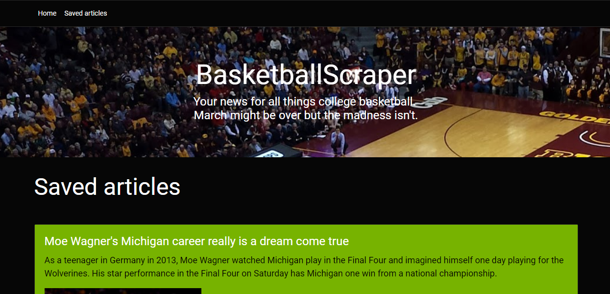
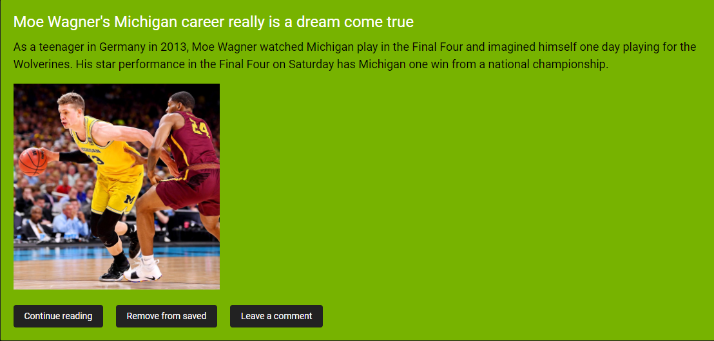
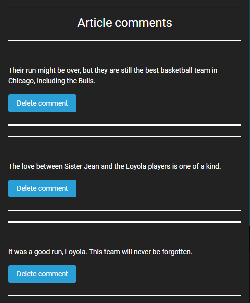

# BasketballScraper
I finished this project about the same time that the 2017-2018 NCAA Men's Basketball season came to end. Looking back at that season in particular, a lot did happen that year. I would have to say that 2017-2018 was one of the more crazy, exciting, and interesting seasons that I can remember. I mean who can forget when Alabama nearly came back from an 11-point deficit with just over 10 minutes left while playing only three players against #14 Minnesota. Don't believe me? Check out the video here: https://www.youtube.com/watch?v=W5gz3vIIhkw.

As a result of all that happened in the news, I decided to create an application that would scrape all the major news articles related to college basketball so that I (and other college basketball fans) could stay connected to the madness year round. More specifically, I used cheerio, MongoDB, Node.js, and various other technologies to scrape sports articles from http://www.espn.com/mens-college-basketball/, store them in a MongoDB database, and then add them to the application where fans can view them and leave comments.

## Table of contents
* [Live](#live)
* [Screenshots](#screenshots)
* [About this project](#about-this-project)
* [Getting started](#getting-started)
* [Technologies used to create app](#technologies-used)
    * [Backend technologies](#Backend)
  	* [Frontend technologies](#Frontend)
* [Issues](#Issues)

## Live
https://hoops-scraper.herokuapp.com/

##  Screenshots

### Home page

 
 

### Saved articles page

 
 

##  About this project

* [How the app works](#how-app-works)
* [How the app is built](#how-the-app-is-built)
* [What is web scraping?](#about-web-scraping)
 
###  How the app works
When you go to the home page of the app, you will see a list of scraped articles that come from the following site:
http://www.espn.com/mens-college-basketball/.

ESPN men's college basketball page

Each scraped article on the home page of the application is saved to the application database. If you want to check for new articles that haven't been scraped from the ESPN men's college basketball site yet, you can click <b>Scrape new articles</b> at the top of the home page.

When you click <b>Scrape new articles</b>, the app first checks the database to see what article titles already exist, which ensures duplicate articles are not added to the database. Then, the app goes ahead and scrapes the site for new articles. If there are new article titles that are not stored in the database already, the app grabs the article information (headline, summary, photo, and link) and adds it to the database. 

Because the app is basically performing three GET requests (one request to get all the articles before scraping, one request to scrape new articles, and a final request to get the updated list of scraped articles), this process might take a couple of seconds. If the app finds new articles, a dialog box will open that displays the number of new articles found. 

If no new articles are found, the app will tell you that no new articles were found from the latest scrape.

After you scrape any new articles, you can scroll through the home page to view all the articles. For each article, there are three options to choose from. You can continue reading, which takes you to the actual article on http://www.espn.com/mens-college-basketball/. 

You can also save articles that you find interesting. When you save an article, it is added to the <b>Saved articles</b> page where you can post comments and start an anonymous discussion thread for that article.

 
 

 
 

From the Home page, you can also delete an article. Deleting an article deletes it from the application database, which means the article is removed from the site. However, the original article is still available to read from http://www.espn.com/mens-college-basketball/.

###  How the app is built
This project uses MongoDB, Node, Express, Handlebars, Mongoose ORM (Object Relational Mapper), and various npm packages such as cheerio. Node and MongoDB are used to query and route data in the application. Express is the backend web framework used for this application, and Handlebars is a templating language that is used to generate the HTML.

For a complete list of technologies used to build this app, go to [Technologies used to create app](#technologies-used).

As you can see, this application was built using many technologies. There are three main technologies in particular that are important in understanding how this app works: cheerio, mongoDB, and Mongoose.

### Cheerio
Cheerio is an npm package that uses the syntax of jQuery so that the app can grab article information from the site we are trying to scrape and load that information into the MongoDB database and the app. For more information, see https://www.npmjs.com/package/cheerio.

### MongoDB
MongoDB is a document-oriented, NoSQL database that stores data in JSON-like (technically, BSON) format. The application uses MongoDB to store the articles that are scraped so that users can view them later and save comments. For more information, see https://docs.mongodb.com/.

### Mongoose
Mongoose is a MongoDB object modeling tool. The best thing about Mongoose is that you can have built-in automatic validation of the data being inserted or updated. For example, in this app, Mongoose validation is used to ensure that there are no duplicate article titles in the database. For more information about the power of Mongoose, see http://mongoosejs.com/.

###  What is web scraping?
Web scraping is the process of grabbing information from another site using a web scraping tool (for example, cheerio), saving that information somewhere (such as a database), and copying the information over to your site. For more information, see https://en.wikipedia.org/wiki/Web_scraping.

##  Getting started
The following section will take you through the steps of setting up this application and getting it running locally on your computer.

If you don't want to set up this project locally and just want to see the deployed application, go to  https://hoops-scraper.herokuapp.com/.

To set up this application locally on your computer, perform the following steps:
  1. [Clone the repository](#clone-repository)
  2. [Install Node.js](#install-node)
  3. [Install the dependencies](#dependencies)
  4. [Install MongoDB](#install-mongo)
  4. [Start the daemon for MongoDB](#mongod)
  5. [Start the MongoDB shell](#mongoshell)
  6. [Install Robo 3T](#install-robo)
  7. [Start the server](#start-server)

###  1. Clone the repository
The first step is to clone the project repository to a local directory on your computer. To clone the repository, run the following commands:
<pre>
  git clone https://github.com/philipstubbs13/NewsScrape.git
  cd NewsScrape
</pre>

####  Structure of the project

After you clone the repository, navigate to the project root directory (NewsScrape). The project directory structure is set up as follows:

<ul>
  <li> 
    
<b>server.js</b>: This file does the following:

		<ul>
	    	<li>Defines and requires the dependencies, including express, body-parser, express-handlebars, mongojs,  morgan, mongoose, and request.</li>
	    	<li>Sets up the Express server.</li>
	    	<li>Sets up the Express server to handle data parsing using body-parser.</li>
	    	<li>Points the server to the API routes, which gives the server a map of how to respond when users visit or request data from various URLs.</li>
            <li>Defines the port the server is listening on.</li>
	    	<li>Starts the server.</li>
            <li>Allows the app to serve static content from the public directory.</li>
            <li>Uses Mongoose (orm) to connect to the mongo database, which allows us to have access to the MongoDB commands to perform CRUD (Create, Read, Update, and Delete) operations. </li>
    	</ul>
  <li>
    
<b>public</b>: Contains the static content (images, Javascript, and CSS). 

    <ul>
      <li><b>assets/css/style.css</b>: External CSS stylesheet.</li>
      <li><b>assets/images</b>: Contains the background image used for this application.</li>
      <li><b>assets/app.js</b>: Contains the front end jQuery ajax POST, GET, PUT, and DELETE requests for adding comments to articles, getting the articles from the database, updating an article when a user saves one, and deleting articles/comments, respectively. </li>
    </ul>
  </li>
  <li>
    
<b>models</b>: Contains 3 files, which define the database schema/structure for this application.

        <ul>
            <li><b>Headline.js</b>: Defines the model for saving articles to the database.</li>
            <li><b>index.js</b>: This file is exporting the models so that the app can use them.</li>
            <li><b>Note.js</b>: Defines the model for saving article comments to the database.</li>
        </ul>
  </li>
  <li>
    
<b>controllers</b>: Contains 3 files, which contain different routes (GET, POST, PUT, and DELETE). These routes are used to pass information to and from the view and model objects.

        <ul>
            <li><b>fetch.js</b>: This file contains the route used to scrape data and save it to the database.</li>
            <li><b>note.js</b>: This file contains routes used for grabbing a specific article and populating it with a comment, finding all the comments associated with an article, posting a comment, and deleting a comment.</li>
            <li><b>headline.js</b>: This file contains routes used to find articles in the database, find saved articles, mark an article as saved, mark an article as unsaved, and delete an article. </li>
        </ul>
  <li>
    
<b>views</b>: Contains the Handlebars files, which are templates used to generate the html files.
 
  </li>
  <li><b>package.json</b>: Lists the project dependencies (third party npm packages) and their version numbers.</li>
  <li><b>.gitignore</b>: Anything listed inside this file (for example, node_modules) will not be tracked by GitHub when code is committed.</li>
  <li><b>package-lock.json</b>: Dependency tree for the project. Lists all the dependencies and their versions.</li>
</ul>

###  2. Install Node.js

If you don't already have Node.js installed on your computer, you can install the latest version here: https://nodejs.org/en/.

###  3. Install the dependencies

The following npm packages are dependencies to the project.

After you clone the repository to a local directory, change directory to the project root directory and run the following command to install the required npm packages:

<pre>npm install</pre>
<ul>
	<li><b>express</b> -  a Node.js web application framework (https://www.npmjs.com/package/express).</li>
	<li><b>body-parser</b> - a package used to parse incoming request bodies in a middleware. (https://www.npmjs.com/package/body-parser)</li>
	<li><b>cheerio</b> - a web scraping tool used to grab information from another site.</li>
    <li><b>axios</b> - a promise based HTTP client for the browser and node.js (https://www.npmjs.com/package/axios)</li>
    <li><b>mongojs</b> - a package that lets you access MongoDB using an API similar to the MongoDB shell.(https://www.npmjs.com/package/mongojs)</li>
    <li><b>mongoose</b> - an ORM that allows you to connect to your MongoDB database and allows you to have access to the MongoDB commands to perform create, read, update, and delete operations on the database(https://www.npmjs.com/package/mongoose).</li>
    <li><b>morgan</b> - an HTML request logger middleware for Node.js that is used to log requests to your application (https://www.npmjs.com/package/morgan).</li>
    <li><b>express-handlebars</b> - allows you to use handlebars to create templates to build the HTML.</li>(https://www.npmjs.com/package/express-handlebars)</li>
    <li><b>request</b> - Allows you to make HTTP requests using Node.js to fetch/scrape data from an external site (https://www.npmjs.com/package/request).</li>
</ul>

Version information for each of these packages is available in the <b>package.json</b> file in the project root directory.

### <a name="install-mongo"> 4. Install MongoDB
For installation instructions, see <a href="https://github.com/philipstubbs13/coding-tips-tricks-resources/blob/master/MongoDB/Installing-MongoDB.md">Installing MongoDB</a>.

###  5. Start the daemon for MongoDB

Run the following command to start the daemon process for MongoDB, which handles data requests, manages data access, and performs background management operations.

<pre>
    mongod
</pre>

<b>Note:</b> You want to keep the mongod process running in the background during development.

###  6. Start the MongoDB shell

In a separate terminal window, run the following command to start up the MongoDB shell

<pre>
mongo
</pre>

###  7. Install Robo 3T

If you don't already have Robo 3T installed on your computer, you can install the latest version here: https://robomongo.org/download

For this project, Robo 3T is similar to MySQL Workbench (if you are used to working with MySQL databases). Robo 3T is not required. But, similar to MySQL Workbench, it is a graphical user interface that is used to visually see the database and database collections (as opposed to using the command line interface for MongoDB).

### <a name="start-server">8. Start the server</a>

After performing all of the setup steps in the <b>Getting started</b> section, navigate to the project root directory (NewsScrape) and run the following command to start the server:

<pre>
nodemon server.js
</pre>

If you don't have nodemon installed on your computer, you can also start the server by running the following command. However, every time you make a change to the server, you will need to restart the server to view the change in the user interface.

<pre>
node server.js
</pre>

To verify that the server has started and the application is working locally on your computer, open Chrome and go to <a href="http://localhost:3000">http://localhost:3000</a>.

##  Technologies used to build app
* [Backend technolgies](#Backend)
* [Frontend technologies](#Frontend)

###  Backend technologies
* Node.js (https://nodejs.org/en/)
* MongoDB (https://www.mongodb.com/)
* Express (http://expressjs.com/)
* Mongoose ORM (http://mongoosejs.com/)
* Javascript

###  Frontend technolgoies
* HTML
* CSS
* Bootstrap (http://getbootstrap.com/)
* Javascript
* jQuery (https://jquery.com/)
* Handlebars (http://handlebarsjs.com/)

##  Issues

If you find an issue while using the app or have a request, <a href="https://github.com/philipstubbs13/NewsScrape/issues/" target="_blank">log the issue or request here</a>. These issues will be addressed in a future code update.
